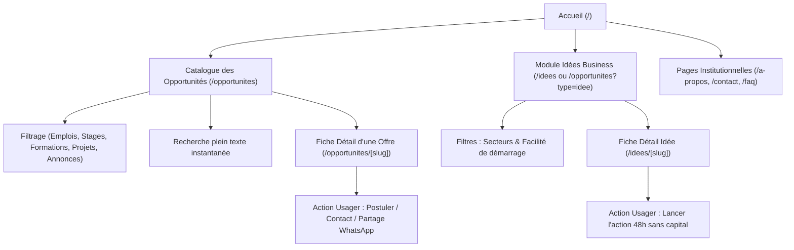
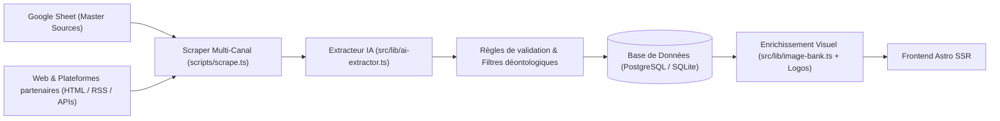
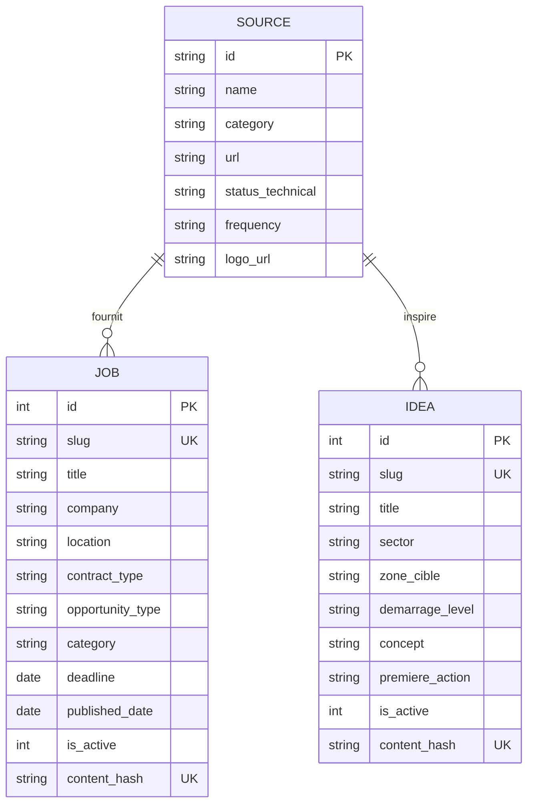

# Documentation Fonctionnelle — Job Avenir Mali

> **Version :** 1.0  
> **Dernière mise à jour :** Mars 2026  
> **Projet :** Job Avenir Mali (`jobavenir.ml`)  
> **Cadre institutionnel :** Accompagnement APEJ (Agence Pour la Promotion de l'Emploi des Jeunes) / Programme PartICIP / Swisscontact / MENEFP  
> **Conception & Développement :** MaliHub Digital  

---

## Sommaire

1. [Vision & Contexte Stratégique](#1-vision--contexte-stratégique)
2. [Profils Utilisateurs & Personas](#2-profils-utilisateurs--personas)
3. [Arborescence & Parcours Utilisateurs](#3-arborescence--parcours-utilisateurs)
4. [Typologies d'Opportunités Gérées](#4-typologies-dopportunités-gérées)
5. [Module « Idées de Projets & Entrepreneuriat »](#5-module-idées-de-projets--entrepreneuriat)
6. [Pipeline d'Ingestion & Automatisation IA](#6-pipeline-dingestion--automatisation-ia)
7. [Règles Métier & Modèle Fonctionnel des Données](#7-règles-métier--modèle-fonctionnel-des-données)
8. [Ergonomie, Accessibilité & Identité Visuelle](#8-ergonomie-accessibilité--identité-visuelle)
9. [Administration & Gouvernance](#9-administration--gouvernance)
10. [Indicateurs Clés de Performance (KPIs) & Évolutions](#10-indicateurs-clés-de-performance-kpis--évolutions)

---

## 1. Vision & Contexte Stratégique

### 1.1 Contexte et Problématique
Au Mali, l'accès à l'information sur l'emploi, les stages et les financements est fortement fragmenté :
- Les annonces sont éparpillées sur une multitude de plateformes privées, de sites institutionnels étatiques, d'ONG internationales et de groupes informels (WhatsApp, Facebook, tableaux d'affichage des agences locales).
- Les jeunes diplômés ou en reconversion font face à des connexions Internet mobiles limitées en débit et coûteuses en data.
- Les conseillers d'orientation des **Espaces d'Orientation Jeunesse (EOJ)** de l'APEJ manquent de centralisation pour orienter efficacement leurs usagers.

### 1.2 Objectif de l'Application Job Avenir
**Job Avenir Mali** est un portail web public et léger qui unifie et démocratise l'accès à l'ensemble des débouchés professionnels et entrepreneuriaux au Mali :
1. **Centralisation exhaustive** : agréger quotidiennement les offres issues d'organismes vérifiés (institutions publiques, bailleurs, ONG, entreprises privées).
2. **Accessibilité mobile first & sobriété** : une expérience ultra-rapide optimisée pour les débits 3G/4G maliens (faible consommation de données).
3. **Stimulation entrepreneuriale** : proposer des opportunités concrètes et des micro-idées d'entreprise réalisables immédiatement avec peu ou pas de capital de départ.
4. **Diffusion multi-canaux** : préparer les contenus pour une rediffusion fluide vers les canaux de prédilection des jeunes (WhatsApp, réseaux sociaux, impression par les conseillers EOJ).

---

## 2. Profils Utilisateurs & Personas

| Profil / Acteur | Rôle & Besoins | Cas d'usage principaux sur la plateforme |
| :--- | :--- | :--- |
| **Jeune diplômé / Primo-demandeur** | Recherche un premier emploi ou un stage de fin d'études / immersion. | - Consulter les offres récentes triées par secteur et localisation.<br>- Filtrer par type d'opportunité (`Stage`, `CDD`, `CDI`).<br>- Accéder directement aux modalités claires de candidature. |
| **Professionnel en activité / Reconversion** | Souhaite évoluer ou se former. | - Découvrir les formations certifiantes et programmes qualifiants.<br>- Veiller sur les recrutements cadres et techniques. |
| **Porteur d'initiatives / Entrepreneur** | Cherche des financements ou des idées d'activité adaptées à son contexte. | - Découvrir les appels à projets et subventions bailleurs.<br>- Explorer le catalogue d'idées business sans capital de départ. |
| **Conseiller d'Orientation EOJ (APEJ)** | Guide les jeunes lors d'entretiens physiques ou via groupes WhatsApp. | - Consulter en temps réel les opportunités actives.<br>- Extraire et partager des fiches d'opportunités fiables à leurs bénéficiaires. |
| **Employeur / Annonceur** | Recrute des talents au Mali. | - Diffusion de ses offres avec mise en avant de sa marque et son logo. |
| **Administrateur MaliHub / APEJ** | Pilote l'inventaire des sources et la qualité des flux. | - Valider les sources de scraping (Google Sheet Master).<br>- Contrôler l'archivage automatique des offres expirées. |

---

## 3. Arborescence & Parcours Utilisateurs



### 3.1 Page d'Accueil (`/`)
- **En-tête institutionnel & Branding républicain** : rappel de la tutelle APEJ / MaliHub conforme à la charte DSML (Design System de l'État Malien).
- **Moteur de recherche unifié & percutant** : saisie libre avec redirection instantanée vers les résultats.
- **Grille des 5 rubriques majeures** avec compteurs d'opportunités en temps réel (Emplois, Stages, Formations, Projets, Idées business).
- **Sélection des dernières opportunités urgentes et pertinentes** avec indication des dates limites.
- **Mise en avant des idées business phares** et des communiqués institutionnels récents.

### 3.2 Catalogue Complet des Opportunités (`/opportunites`)
- **Filtres interactifs par onglets** : *Tous*, *Emplois*, *Stages & Immersion*, *Formations Métiers*, *Projets & Subventions*, *Idées business*, *Annonces & Veille*.
- **Filtres sectoriels** (Informatique & Tech, Finance & Gestion, Agriculture & Élevage, Santé & Social, BTP, etc.).
- **Barre de recherche instantanée** : filtrage côté client en temps réel sans rechargement de page.
- **Cartes d'offres standardisées** affichant :
  - Logo officiel de l'employeur ou de la source émettrice.
  - Titre du poste, employeur et ville de localisation.
  - Type de contrat (badge coloré : CDI, CDD, Stage, Formation, Subvention).
  - Date limite de candidature mise en valeur visuellement.
  - Résumé clair de la mission.

### 3.3 Page Détail d'une Opportunité (`/opportunites/[slug]`)
- **Bannière contextualisée** avec imagerie professionnelle thématique (banque d'images Mali intégrée).
- **Bloc d'identification** : Organisme recruteur, logo, statut du contrat, échéance.
- **Description détaillée de l'offre** : contexte de la mission, profil recherché, compétences exigées.
- **Encadré « Comment postuler »** : adresse email de réception, dépôt physique à l'agence ou lien externe vers le portail officiel de l'employeur.
- **Bouton de partage direct** pour messageries instantanées (WhatsApp) et réseaux sociaux.

---

## 4. Typologies d'Opportunités Gérées

Job Avenir segmente les annonces en 5 typologies fonctionnelles strictes :

```
┌────────────────────────────────────────────────────────────────────────┐
│                        TYPOLOGIES JOB AVENIR                           │
├───────────────┬───────────────┬───────────────┬──────────────┬─────────┤
│    EMPLOIS    │    STAGES     │  FORMATIONS   │   PROJETS    │ ANNONCES│
│   (CDI/CDD)   │  (Immersion)  │   (Métiers)   │(Subventions) │ (Veille)│
└───────────────┴───────────────┴───────────────┴──────────────┴─────────┘
```

1. **Emplois salariés (`JOB`)** :
   - Contrats CDI, CDD, Intérim, Postes d'experts ou de consultants.
   - Attributs clés : entreprise, lieu de travail, type de contrat, compétences, fourchette salariale (si divulguée).
2. **Stages & Immersion (`STAGE`)** :
   - Stages académiques, stages de qualification professionnelle (notamment programmes d'immersion APEJ).
   - Attributs clés : niveau d'études requis, durée du stage, indemnité/gratification.
3. **Formations Métiers (`TRAINING`)** :
   - Formations professionnelles courtes ou certifiantes, apprentissages, perfectionnement technique.
   - Attributs clés : organisme formateur, filière, conditions de prise en charge ou bourse.
4. **Appels à projets & Financements (`PROJECT_CALL`)** :
   - Subventions de bailleurs (Banque Mondiale, UE, Coopérations), concours de start-ups, fonds d'amorçage jeunes entrepreneurs.
   - Attributs clés : cible éligible, montant/enveloppe de subvention, calendrier de clôture.
5. **Annonces & Veille institutionnelle (`ANNOUNCEMENT`)** :
   - Communiqués de concours de la fonction publique, avis d'orientation, communications ministérielles.

---

## 5. Module « Idées de Projets & Entrepreneuriat »

### 5.1 Philosophie Fonctionnelle
Le module **Idées Business** (`/idees`) a été spécialement conçu pour répondre au chômage structurel et au manque de débouchés salariés formels en milieu urbain et périurbain malien.

Les fiches publiées respectent 4 principes non négociables :
1. **Zéro promesse financière chiffrée** : aucune mention de montants de gains irréalistes ou de « rentabilité garantie ».
2. **Contextualisation stricte à l'écosystème malien** : exploitation des canaux de proximité (WhatsApp Business, Orange Money, Wave, marchés locaux, circuits courts).
3. **Action test immédiate (règle des 48h)** : chaque idée propose une première action concrète testable en moins de 48 heures sans dépenser de capital.
4. **Démarche d'amorçage pragmatique** : classification claire selon l'effort de démarrage.

### 5.2 Niveaux d'Effort de Démarrage
Chaque micro-projet est catégorisé selon son niveau d'investissement initial :
- 🟢 **Très faible** : Nécessite uniquement un téléphone portable, des compétences de mise en relation, de la vente directe ou du service à domicile. Aucun capital financier requis.
- 🟡 **Modéré** : Nécessite un outillage basique ou un petit stock d'amorçage.
- 🔴 **Conséquent** : Nécessite un local dédié, du matériel semi-professionnel ou des fonds de roulement plus importants (souvent adossé à un appel à subvention ou prêt APEJ).

### 5.3 Structure d'une Fiche Idée
- **Intitulé du concept** (ex. : *« Service de préparation et livraison de paniers d'épices fraîches à domicile »*).
- **Secteur d'activité** et **Zone géographique cible** (ex. : Bamako, Ségou, Sikasso).
- **Besoin identifié** : le problème concret constaté sur le terrain chez les ménages ou artisans locaux.
- **Concept & Proposition de valeur** : comment le service résout le besoin.
- **Public cible** : qui sont les clients prioritaires prêts à payer.
- **Compétences clés requises** : savoir-faire humains et techniques nécessaires.
- **Première action sous 48h** : protocole de test sans budget pour valider la demande avant tout engagement.

---

## 6. Pipeline d'Ingestion & Automatisation IA

Job Avenir fonctionne grâce à un pipeline automatisé combinant **scraping multi-sources**, **normalisation LLM** et **génération d'actifs visuels**.



### 6.1 Gouvernance des Sources via Google Sheets
Les sources d'annonces sont administrées via une feuille de calcul partagée (*Google Sheets*) sans besoin d'intervention dans le code source :
- URL de la source, type de scraper (`HTML_GENERIC_PARSER`, `RSS`, etc.).
- Statut technique (`ACTIF_200`, `ACTIF_403`).
- Catégorisation de la source (Institutionnelle, Privée, ONG, Université).

### 6.2 Traitement par Intelligence Artificielle (OpenRouter LLM)
Lorsqu'un contenu brut est extrait :
1. **Extraction structurée** : conversion du texte non structuré en objet JSON typé (Titre, Entreprise, Localisation, Type de contrat, Résumé, Date limite, Compétences).
2. **Filtre anti-bruit** : l'IA écarte les communiqués administratifs non exploitables ou les spams (`parsed.ignore = true`).
3. **Classification typologique** : affectation automatique à l'un des 5 types d'opportunités.
4. **Déduplication par empreinte numérique (`content_hash`)** : calcul d'un hash SHA-256 évitant tout doublon d'offre en base de données.

### 6.3 Cycle de Vie et Dépréciation Automatique
- **Archivage automatique des offres expirées** : un cron quotidien passe les opportunités dont la `deadline < CURRENT_DATE` à l'état inactif (`is_active = 0`).
- **Garde-fou anti-résurrection** : une offre archivée ne peut pas être réactivée lors du scrape suivant si son contenu n'a pas changé.

---

## 7. Règles Métier & Modèle Fonctionnel des Données

### 7.1 Entités Principales



### 7.2 Règles de Gestion Métier
1. **RG-01 (Unicité des offres)** : Deux opportunités avec le même titre, la même entreprise et le même descriptif fondamental partagent le même `content_hash` et ne peuvent être insérées en double.
2. **RG-02 (Localisation par défaut)** : Si aucune région n'est spécifiée dans l'annonce source, la localisation par défaut attribuée est `Bamako, Mali`.
3. **RG-03 (Filtrage d'intégrité des idées)** : Toute idée commerciale générée contenant des promesses de rémunération monétaire fixe (ex. : *"Gagnez 500 000 FCFA/mois"*) est immédiatement rejetée par l'extracteur.
4. **RG-04 (Archivage temporel)** : Les offres dont la date limite est échue restent archivées en base pour l'historique et les statistiques d'orientation, mais sont masquées des flux publics des usagers.

---

## 8. Ergonomie, Accessibilité & Identité Visuelle

### 8.1 Charte Graphique & Design System de l'État Malien (DSML)
L'interface de Job Avenir est alignée avec les recommandations du **DSML** et les spécificités culturelles locales :
- **Couleurs de la République et Teintes Terroirs** :
  - *Vert Espoir Malien* : pour les statuts positifs, les stages et les validations.
  - *Or Mandingue & Ambre doux* : chaleur humaine, orientation et mise en valeur des titres majeurs.
  - *Bogolan & Kaolin* : fonds de page doux pour une lecture reposante sans éblouissement sur écran de smartphone.
  - *Bleu Fleuve / Indigo* : institutionnel, rigueur et professionnalisme.

### 8.2 Sobriété Numérique & Performance Réseau
- **Poids minimal des pages** : images converties au format moderne WebP ultra-compressé.
- **Rendu Serveur (SSR) & Zéro Dépendance Lourde** : chargement instantané sans barres de chargement bloquantes, même avec un signal réseau instable.
- **Lisibilité optimale** : typographies calibrées, forts contrastes pour utilisation en plein soleil, boutons tactiles larges pour les pouces sur mobile.

---

## 9. Administration & Gouvernance

### 9.1 Gestion de l'Inventaire des Sources
L'équipe de modération de MaliHub / APEJ administre les sources de données via une interface collaborative sans manipulation de code :
- Ajout de sites d'entreprises locales ou de portails régionaux.
- Suspension temporaire d'un scraper défaillant sans impacter le reste du catalogue.
- Synchronisation automatique quotidienne des logos des entreprises partenaires.

### 9.2 Sécurité & Confidentialité
- **Protection des usagers** : la consultation des offres ne requiert aucune création de compte obligatoire, évitant la collecte superflue de données à caractère personnel.
- **Conformité nationale** : respect de la législation malienne sur la protection des données personnelles (Loi n°2013-015).
- **Intégrité des liens sortants** : validation des URL d'origine pour protéger les jeunes chercheurs d'emploi contre le hameçonnage ou les fausses annonces frauduleuses.

---

## 10. Indicateurs Clés de Performance (KPIs) & Évolutions

### 10.1 Indicateurs de Pilotage (KPIs)
- **Volume d'opportunités actives** : nombre total d'offres en cours par typologie (`Emplois`, `Stages`, `Formations`, `Projets`).
- **Taux de couverture territoriale** : part des opportunités proposées en dehors du district de Bamako (Sikasso, Ségou, Mopti, Kayes, etc.).
- **Fraîcheur des données** : délai moyen entre la publication originale d'une annonce et son apparition sur Job Avenir (< 24 heures).
- **Engagement sur les idées business** : fiches d'idées les plus partagées et consultées par les usagers.

### 10.2 Perspectives d'Évolution Fonctionnelle
1. **Passerelle WhatsApp & Chatbot d'Orientation** : distribution automatique des fiches résumées d'offres directement dans les groupes WhatsApp des EOJ.
2. **Fiches Imprimables A4 pour Agences** : génération en 1 clic d'un récapitulatif PDF hebdomadaire des offres à afficher sur les tableaux physiques des agences régionales APEJ.
3. **Module Vocal & Langues Nationales** : résumé audio des opportunités et des idées d'entreprise en **Bambara** pour les publics non scripteurs.
